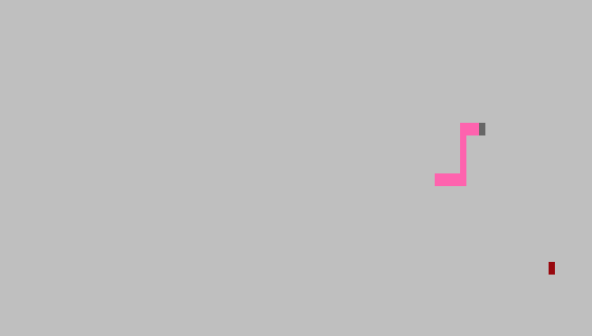
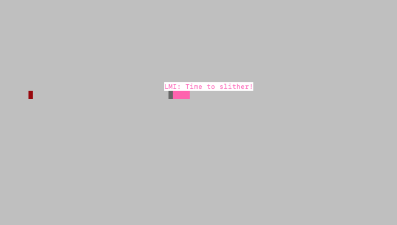
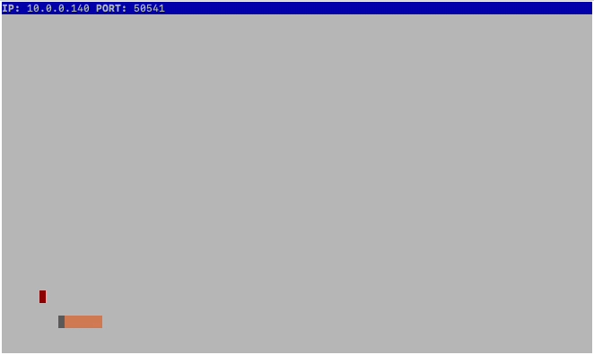

# Snake Client Project

Snake is a very popular video game where the player maneuvers a dot and grows it by ‘eating’ pieces of food. As it moves and eats, it grows and the growing snake becomes an obstacle to smooth maneuvers. The goal is to grow it to become as big as possible without bumping into the side walls, or bumping into itself, upon which it dies.

This is a Lighthouse Labs student project building on [Tania Rascia's 'Snek'](https://github.com/taniarascia/snek) for a version of the game implemented in JavaScript (Node.js).

Before you can run this client, you will need to be running the server side which you can download and install from here. 

## Previews

## Getting Started

- Follow steps inside the [Snek server repo](https://github.com/taniarascia/snek) to run the server side.
- Run the development snake client using the `node play.js` command.

## To Play
- Run `node play.js ___` command. Your username should be three letters. Eg. `node play.js LMI`.
- Use the following keys to move the snake:
  - `W`: Move up
  - `A`: Move left
  - `S`: Move down
  - `D`: Move right
- Shout out a canned message by hitting the following:
  - `1`: How are you?
  - `2`: Time to slither!
  - `3`: Let's race!
- To exit the game early, hit `CTRL + C`

Enjoy!